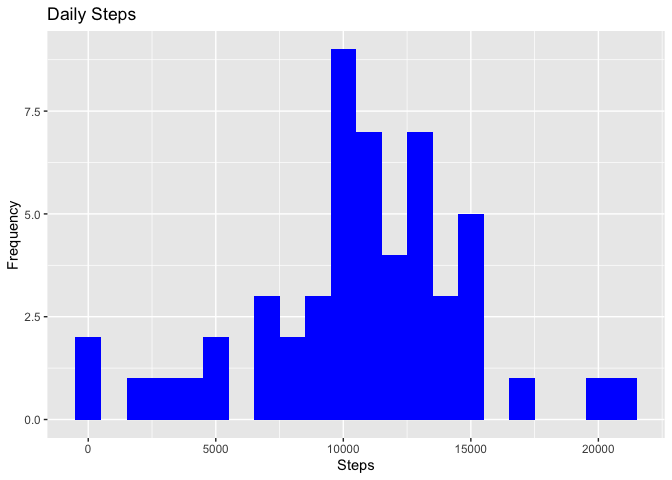
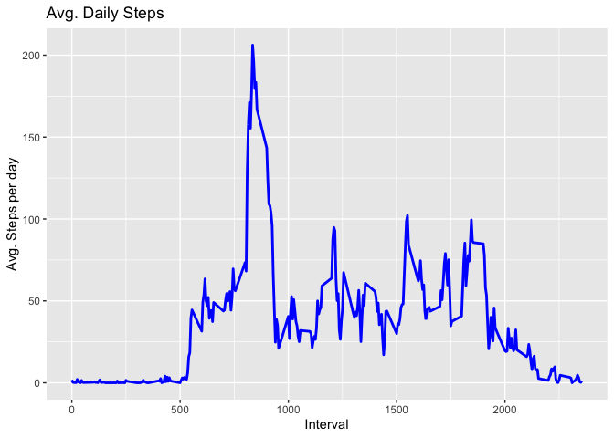
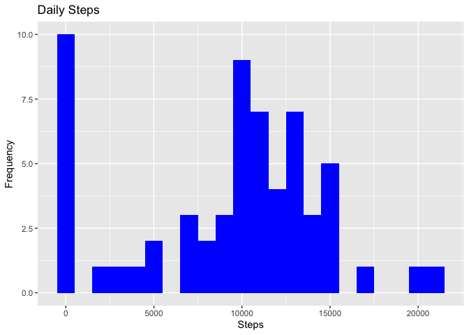
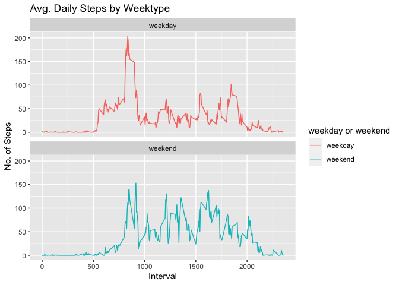

## Loading and preprocessing the data

We will first initialize all the packages that we will need to be using.
Then we can download and load in the data from the provided URL, as well as
unzip it and have it ready for use. Before moving onto the next step, we will
finish this section off by reading the csv data from the url file to our
program. 


```r
library(knitr)
library(data.table)
library(ggplot2)

fileUrl <- "https://d396qusza40orc.cloudfront.net/repdata%2Fdata%2Factivity.zip"
download.file(fileUrl, destfile = paste0(getwd(), '/repdata%2Fdata%2Factivity.zip')
              , method = "curl")
unzip("repdata%2Fdata%2Factivity.zip",exdir = "data")

activityDT <- data.table::fread(input = "data/activity.csv")
```

## What is mean total number of steps taken per day?

We first calculate the total number of steps taken per day.
Then, we create a histogram.
Finally, we calcualte and report the mean and median of the number of steps
per day.


```r
Total_Steps <- activityDT[, c(lapply(.SD, sum, na.rm = FALSE))
                          , .SDcols = c("steps"), by = .(date)] 
head(Total_Steps, 10)
```

```
##           date steps
##  1: 2012-10-01    NA
##  2: 2012-10-02   126
##  3: 2012-10-03 11352
##  4: 2012-10-04 12116
##  5: 2012-10-05 13294
##  6: 2012-10-06 15420
##  7: 2012-10-07 11015
##  8: 2012-10-08    NA
##  9: 2012-10-09 12811
## 10: 2012-10-10  9900
```

```r
ggplot(Total_Steps, aes(x = steps)) +
    geom_histogram(fill = "blue", binwidth = 1000) +
    labs(title = "Daily Steps", x = "Steps", y = "Frequency")
```

```
## Warning: Removed 8 rows containing non-finite values (stat_bin).
```

<!-- -->

```r
Total_Steps[, .(Mean_Steps = mean(steps, na.rm = TRUE)
                , Median_Steps = median(steps, na.rm = TRUE))]
```

```
##    Mean_Steps Median_Steps
## 1:   10766.19        10765
```

## What is the average daily activity pattern?

We start off with making a time series plot with the specified 5 minute intervals.
On the X axis, we have the time, and on Y we have the average number of daily
steps. 

We can use this to find which interval has the most steps, across the days counted
in the dataset.


```r
IntervalDT <- activityDT[, c(lapply(.SD, mean, na.rm = TRUE))
                         , .SDcols = c("steps"), by = .(interval)] 
ggplot(IntervalDT, aes(x = interval , y = steps)) + geom_line(color="blue"
        , size=1) + labs(title = "Avg. Daily Steps" , x = "Interval"
        , y = "Avg. Steps per day")
```

<!-- -->

```r
IntervalDT[steps == max(steps), .(max_interval = interval)]
```

```
##    max_interval
## 1:          835
```

## Imputing missing values

First, we find the total number of missing values in the dataset, and then
find a way to fill in the missing places with data.

In this case, the missing value spots were filled with the median value for the
steps of that particular day.

Then we made a new dataset that is equal to the original, only now this one
should not have any missing data.

Finally, make a new histogram. 


```r
nrow(activityDT[is.na(steps),])
```

```
## [1] 2304
```

```r
activityDT[is.na(steps), "steps"] <- activityDT[, c(lapply(.SD, median, na.rm = TRUE))
                                                , .SDcols = c("steps")]

data.table::fwrite(x = activityDT, file = "data/tidyData.csv", quote = FALSE)

Total_Steps <- activityDT[, c(lapply(.SD, sum)), .SDcols = c("steps"), by = .(date)]

Total_Steps[, .(Mean_Steps = mean(steps), Median_Steps = median(steps))]
```

```
##    Mean_Steps Median_Steps
## 1:    9354.23        10395
```

```r
ggplot(Total_Steps, aes(x = steps)) + geom_histogram(fill = "blue", binwidth = 1000) + 
        labs(title = "Daily Steps", x = "Steps", y = "Frequency")
```

<!-- -->

## Are there differences in activity patterns between weekdays and weekends?

We can begin by creating a new variable in the dataset which will have two levels,
one for the weekdays, and one for the weekends. 

With this done, we can then make a panel plot which will have the same 5 minute
intervals and the average number of steps taken for the weekdays and the 
weekends. 


```r
activityDT[, date := as.POSIXct(date, format = "%Y-%m-%d")]
activityDT[, `Day of Week`:= weekdays(x = date)]
activityDT[grepl(pattern = "Monday|Tuesday|Wednesday|Thursday|Friday"
                 , x = `Day of Week`), "weekday or weekend"] <- "weekday"
activityDT[grepl(pattern = "Saturday|Sunday", x = `Day of Week`)
           , "weekday or weekend"] <- "weekend"
activityDT[, `weekday or weekend` := as.factor(`weekday or weekend`)]
head(activityDT, 10)
```

```
##     steps       date interval Day of Week weekday or weekend
##  1:     0 2012-10-01        0      Monday            weekday
##  2:     0 2012-10-01        5      Monday            weekday
##  3:     0 2012-10-01       10      Monday            weekday
##  4:     0 2012-10-01       15      Monday            weekday
##  5:     0 2012-10-01       20      Monday            weekday
##  6:     0 2012-10-01       25      Monday            weekday
##  7:     0 2012-10-01       30      Monday            weekday
##  8:     0 2012-10-01       35      Monday            weekday
##  9:     0 2012-10-01       40      Monday            weekday
## 10:     0 2012-10-01       45      Monday            weekday
```

```r
activityDT[is.na(steps), "steps"] <- activityDT[, c(lapply(.SD, median, na.rm = TRUE))
                                                , .SDcols = c("steps")]
IntervalDT <- activityDT[, c(lapply(.SD, mean, na.rm = TRUE)), .SDcols = c("steps")
                         , by = .(interval, `weekday or weekend`)] 
ggplot(IntervalDT , aes(x = interval , y = steps, color=`weekday or weekend`)) + 
        geom_line() + labs(title = "Avg. Daily Steps by Weektype"
                           , x = "Interval", y = "No. of Steps") + 
        facet_wrap(~`weekday or weekend` , ncol = 1, nrow=2)
```

<!-- -->
